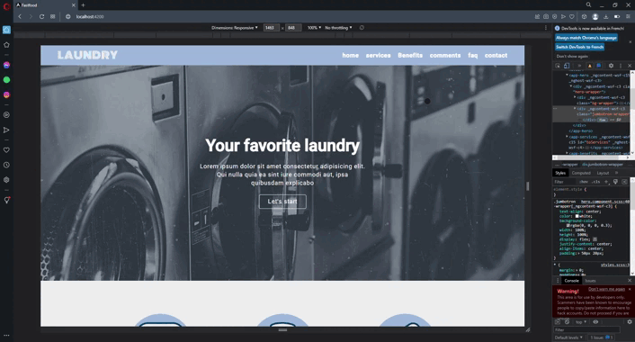

# Project front end Angular



## [ ----> [View demo](https://elmiriyounes.github.io/Angular/) <---- ]

## About-the-project 🚀

This is a website using Angular to show a demonstration of my skills.

### 🛠 Built with

* 
* 

## ⚡️ Clone the repo

* Clone the repository:
    ```gitbash
    git clone git@github.com:ElmiriYounes/Angular.git
    ```

* Install the packages (from the root folder):
    ```gitbash
    npm install
    ```

* Get started (from the root folder):
    ```gitbash
    ng serve -o
    ```

## 💬 Contact

El miri younes - elmiri.younes@hotmail.com